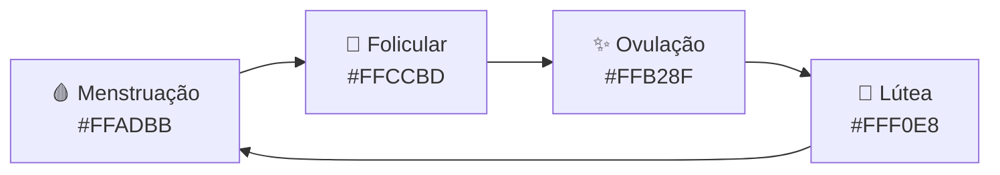
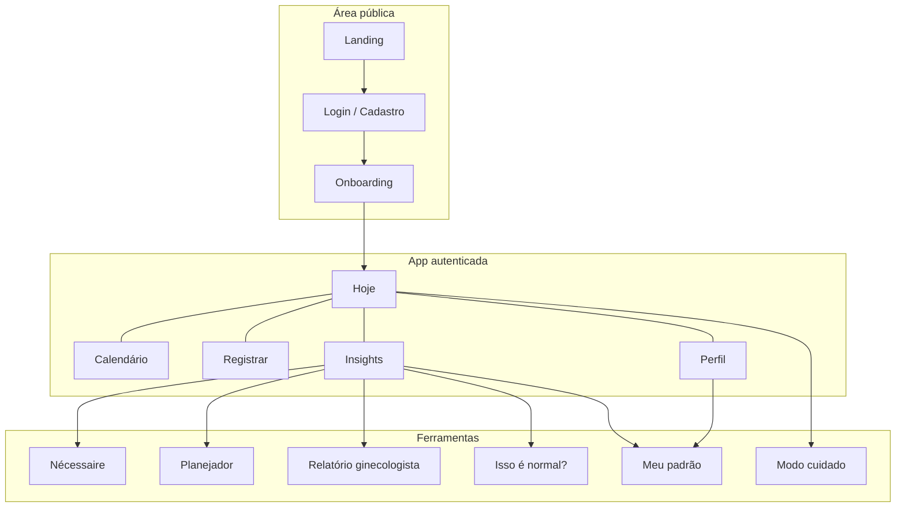

<div align="center">


# Bloom

**Seu ciclo, com cuidado.**

Aplicativo web mobile-first para acompanhar o ciclo menstrual com carinho, clareza e privacidade — sem pressão, no seu ritmo.

<br />

[](https://nextjs.org/)
[](https://www.typescriptlang.org/)
[](https://supabase.com/)
[](https://tailwindcss.com/)

</div>

---

## ✨ Visão geral

O **Bloom** nasceu da ideia de transformar o acompanhamento do ciclo em algo **acolhedor**, não clínico demais. Em vez de telas frias, o app usa uma identidade pastel, cards com cara de “janelinha” e um mascote — um patinho — que acompanha cada fase da jornada.

> *Registre só o que quiser, sem pressão.*

<table>
  <tr>
    <td width="50%" valign="top">

### O que o app faz

- Calendário com menstruação, janela fértil e previsões
- Check-in diário personalizável (humor, sintomas, fluxo, sono…)
- Insights e trilha visual do ciclo
- Ferramentas do dia a dia: nécessaire, planejador, relatório médico
- Modo cuidado para dias difíceis
- Modo discreto para privacidade na tela

    </td>
    <td width="50%" valign="top">

### Princípios de design

- **Mobile-first** — navegação inferior, gestos naturais
- **Pastel & suave** — rosa, pêssego e creme, sem branco agressivo
- **Cards “janela”** — header rosa, corpo creme, sombra deslocada
- **Linguagem humana** — tom gentil, nunca alarmista
- **Dados seus** — Supabase com RLS; nada de vender dados

    </td>
  </tr>
</table>

---

## 🎨 Design system

Identidade visual pensada como um **caderno de anotações fofo**: bordas arredondadas, tipografia arredondada (*Quicksand*) e bolinhas pastel no fundo.

### Paleta

<table>
  <tr>
    <td align="center" bgcolor="#FFADBB" width="80" height="56">&nbsp;</td>
    <td><strong>Rosa Bloom</strong><br><code>#FFADBB</code> · headers, CTAs, fase menstrual</td>
  </tr>
  <tr>
    <td align="center" bgcolor="#FFB28F" width="80" height="56">&nbsp;</td>
    <td><strong>Pêssego</strong><br><code>#FFB28F</code> · destaques, ovulação</td>
  </tr>
  <tr>
    <td align="center" bgcolor="#FFCCBD" width="80" height="56">&nbsp;</td>
    <td><strong>Pêssego claro</strong><br><code>#FFCCBD</code> · superfícies secundárias</td>
  </tr>
  <tr>
    <td align="center" bgcolor="#FFFBDE" width="80" height="56">&nbsp;</td>
    <td><strong>Creme</strong><br><code>#FFFBDE</code> · corpo dos cards, inputs</td>
  </tr>
  <tr>
    <td align="center" bgcolor="#4A3238" width="80" height="56">&nbsp;</td>
    <td><strong>Texto</strong><br><code>#4A3238</code> · marrom quente, legível e acolhedor</td>
  </tr>
</table>

### Componentes-chave

| Elemento | Descrição |
|----------|-----------|
| **Card Bloom** | Header rosa + corpo creme + borda marrom suave + sombra `7px 7px` deslocada |
| **Chips** | Pílulas selecionáveis para humor, sintomas e fluxo |
| **Bottom nav** | 5 abas; botão central “Registrar” em destaque |
| **Mascote** | Pato contextual por tela (flores, caderno, médico, triste…) |

### Prévia da interface

```
┌─────────────────────────────────────┐
│  ░░░ fundo bolinhas rosa pastel ░░░ │
│                                     │
│   ┌─────────────────────────────┐   │
│   │ Menstruação            ○○○ │   │  ← header rosa
│   ├─────────────────────────────┤   │
│   │                             │   │
│   │  ( ) Sem menstruação hoje   │   │  ← corpo creme
│   │  ( ) Início hoje            │   │
│   │                             │   │
│   │  [Spotting] [Leve] [Mod.]   │   │  ← chips
│   └─────────────────────────────┘   │
│                                     │
│         🦆  pato nas flores         │
│                                     │
│  ┌────┬────┬──────┬────┬────┐      │
│  │ 📅 │ ☀️ │  ➕  │ 📊 │ 👤 │      │  ← bottom nav
│  └────┴────┴──────┴────┴────┘      │
└─────────────────────────────────────┘
        max-width ~480px · mobile-first
```

### Fases do ciclo → cor



---

## 🦆 Mascote & telas

Cada área do app tem um pato diferente — reforça o tom emocional sem poluir a UI.

<table>
  <tr>
    <td align="center"><br><sub><b>Registrar</b></sub></td>
    <td align="center"><br><sub><b>Meu padrão</b></sub></td>
    <td align="center"><br><sub><b>Trilha do ciclo</b></sub></td>
    <td align="center"><br><sub><b>Nécessaire</b></sub></td>
  </tr>
  <tr>
    <td align="center"><br><sub><b>Planejador</b></sub></td>
    <td align="center"><br><sub><b>Relatório</b></sub></td>
    <td align="center"><br><sub><b>Modo cuidado</b></sub></td>
    <td align="center"><br><sub><b>Perfil</b></sub></td>
  </tr>
</table>

---

## 🧭 Mapa do app



| Rota | Tela |
|------|------|
| `/app/hoje` | Dashboard do dia, ciclo hoje, atalhos |
| `/app/calendario` | Visão mensal com fases e previsões |
| `/app/registrar` | Check-in diário completo |
| `/app/insights` | Gráficos, trilha do ciclo, ferramentas |
| `/app/meu-padrao` | Retrato personalizado do seu ciclo |
| `/app/bolsinha` | Nécessaire — itens do ciclo |
| `/app/planejador` | Eventos alinhados ao ciclo |
| `/app/relatorio` | Resumo para consulta médica |
| `/app/isso-e-normal` | Contexto sobre sintomas |
| `/app/cuidado` | Modo leve para dias difíceis |
| `/app/perfil` | Conta, preferências, conquistas |

---

## 🛠 Stack

| Camada | Tecnologia |
|--------|------------|
| UI | Next.js App Router, React, Tailwind CSS + CSS Bloom |
| Lógica | TypeScript |
| Build | Next.js 15 |
| Backend | Supabase (PostgreSQL, Auth, RLS) |
| Gráficos | Chart.js |
| Testes | Vitest |
| Deploy | Vercel (recomendado) |

### Estrutura do projeto

```
src/app/         # Rotas App Router (landing, auth, app)
src/components/  # Shell React, auth, chat, cards
src/lib/         # Config, services, utils, Supabase
src/styles/      # Design tokens e CSS Bloom
src/legacy-runtime/ # Telas de domínio portadas
public/          # Mascotes, favicon, assets estáticos
supabase/        # Migrations SQL
tests/           # Vitest
docs/            # Guias Supabase, deploy e arquitetura
```

---

## 🚀 Como rodar

### Pré-requisitos

- Node.js 18+
- Conta no [Supabase](https://supabase.com/) (para auth e persistência)

### Instalação

```bash
git clone https://github.com/beatrizkodayashi/Koda-Bloom.git
cd Koda-Bloom
npm install
cp .env.example .env.local
```

Preencha no `.env.local`:

```env
NEXT_PUBLIC_SUPABASE_URL=sua_url
NEXT_PUBLIC_SUPABASE_ANON_KEY=sua_chave
```

```bash
npm run dev
```

Abra **http://localhost:3000**

### Scripts

| Comando | Descrição |
|---------|-----------|
| `npm run dev` | Servidor de desenvolvimento (Next.js) |
| `npm run build` | Build de produção |
| `npm start` | Sobe o build de produção |
| `npm test` | Testes com Vitest |

### Supabase

1. Crie um projeto no Supabase
2. Execute `supabase/migrations/001_initial_schema.sql`
3. Execute `supabase/migrations/002_rls_policies.sql`
4. Configure as variáveis no `.env.local`

Guia completo: [`docs/SUPABASE.md`](docs/SUPABASE.md)

### Deploy

Guia: [`docs/DEPLOY_VERCEL.md`](docs/DEPLOY_VERCEL.md)

---

## 🌸 Processo de criação

O Bloom foi construído em camadas — primeiro a **identidade visual** (paleta, cards, tipografia), depois a **experiência mobile** (bottom nav, check-in por chips) e por fim a **inteligência** que transforma registros em insights gentis.

```
Design tokens (variables.css)
        ↓
Componentes base (cards, chips, botões)
        ↓
Fluxo SPA + rotas
        ↓
Supabase + auth + RLS
        ↓
Features Bloom (fases 1 e 2)
        ↓
Refino contínuo de copy, mascotes e UX
```

Roadmap detalhado: [`ROADMAP.md`](ROADMAP.md) · Arquitetura: [`docs/ARCHITECTURE.md`](docs/ARCHITECTURE.md)

---

## ⚕️ Aviso de saúde

O Bloom fornece **estimativas** baseadas nos dados que você registra. Ele **não substitui** orientação, diagnóstico ou acompanhamento médico. Em caso de dúvida ou sintomas persistentes, procure um profissional de saúde.

---

## 📄 Licença

Projeto privado — todos os direitos reservados.

---

<div align="center">

Feito com carinho por **Beatriz** · Bloom v0.1.0


</div>
